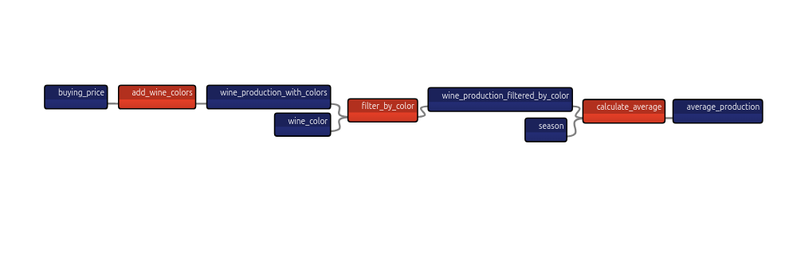
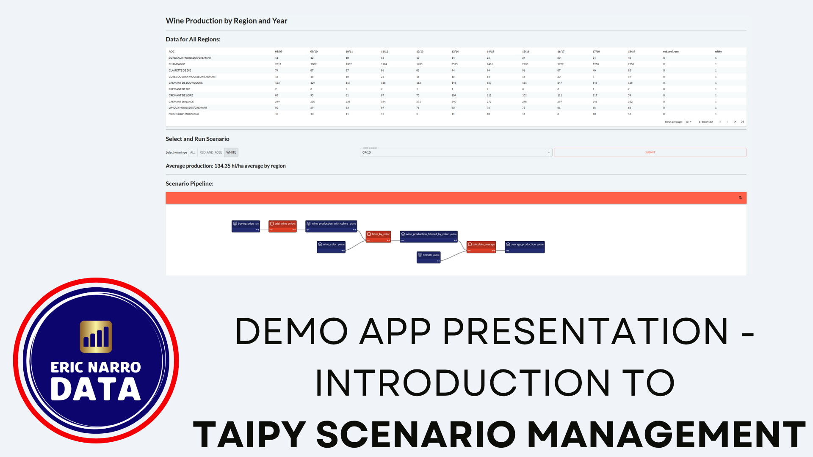

# TAIPY Scenario Management Minimal App

[](https://github.com/psf/black)


- [TAIPY Scenario Management Minimal App](#taipy-scenario-management-minimal-app)
  - [What is this app?](#what-is-this-app)
  - [Video presentation](#video-presentation)
  - [Running the App](#running-the-app)
  - [Data sources](#data-sources)
  - [Old Version of the App](#old-version-of-the-app)

## What is this app?

This is an app that shows the essential elements of Taipy Scenario Management.

It intends to be a minimal example, and doesn't dive into the complex settings of Scenario Management.

The app uses a pipeline that reads a CSV file as a DataFrame, transforms it and calculates the average yield for a wine production season in France. It also filters on a particular wine color (red/rosé, white, or both).



## Video presentation

> Warning: The video presentation has a mistake: the data does not show yield, but **total wine production, in thousand hectoliters**, instead. The application works exactly the same.

[](https://www.youtube.com/watch?v=FtUG5SYOiNE&t=27s)

## Running the App

To run the app directly using `uv`, you can run the following command from the root directory:

```bash
uv run --directory src main.py
```

## Data sources

You can find the dataset [in my Kaggle page](https://www.kaggle.com/datasets/ericnarro/volumes-wine-production-aoc-2009-2019).

The original source data is a [pdf file by France Agrimer](https://www.franceagrimer.fr/fam/content/download/62836/document/chiffres-fili%C3%A8re-viti-vinicole-2008-2018.pdf?version=).

You can find the process I followed to create the CSV file [in my blog's article about it](https://www.ericnarrodata.com/blog/2023/pdf_table_wine_production.html).

## Old Version of the App

📚 I used this demo to write [a Medium article about how to use Taipy Core](https://medium.com/gitconnected/how-to-use-taipy-core-build-pipelines-for-better-applications-%EF%B8%8F-d40e5bc9aed3). 📚

I used Taipy 2.3 to build it, but I upgraded the app ever since. The new app is different (has more elements, uses different application builders and configuration styles...), so I decided to keep the original one in a branch called `old_version`.
