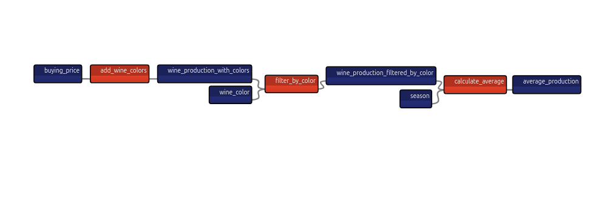
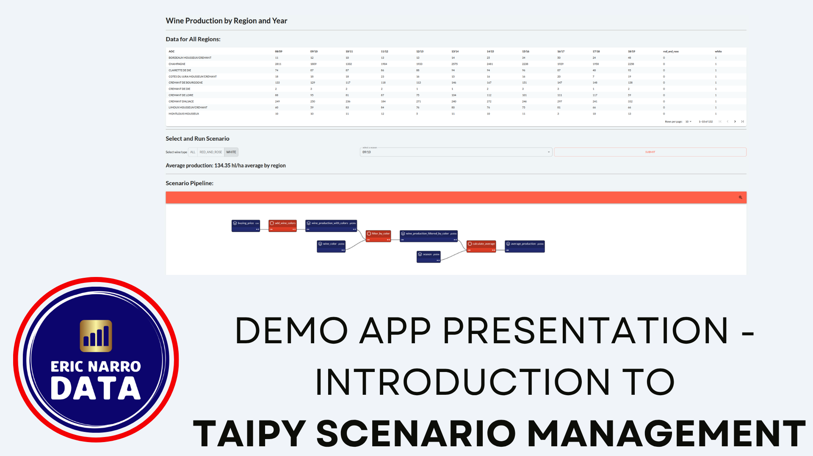

# TAIPY Scenario Management Minimal App

[](https://github.com/psf/black)


[](https://docs.taipy.io/en/latest/)
[](https://codecov.io/github/enarroied/taipy_core_demo)


- [TAIPY Scenario Management Minimal App](#taipy-scenario-management-minimal-app)
  - [What is this app?](#what-is-this-app)
  - [Video presentation](#video-presentation)
    - [Run Locally](#run-locally)
    - [Run with Docker](#run-with-docker)
  - [Data sources](#data-sources)
  - [Old Version of the App](#old-version-of-the-app)

## What is this app?

This is an app that shows the essential elements of Taipy Scenario Management.

It intends to be a minimal example, and doesn't dive into the complex settings of Scenario Management.

The app uses a pipeline that reads a CSV file as a DataFrame, transforms it and calculates the average yield for a wine production season in France. It also filters on a particular wine color (red/rosé, white, or both).



## Video presentation

> Warning: The video presentation has a mistake: the data does not show yield, but **total wine production, in thousand hectoliters**, instead. The application works exactly the same.

[](https://www.youtube.com/watch?v=FtUG5SYOiNE&t=27s)


### Run Locally

To run locally, you can use [`uv`](https://docs.astral.sh/uv/) to create a virtual environment and install dependencies from `pyproject.toml`:

```bash
uv venv
uv pip install -r pyproject.toml
```

Then run the app:

```bash
cd src
python main.py
```

Or, from the project root, directly with uv:

```bash
uv run --directory src main.py
```

### Run with Docker

Build the Docker image:

```bash
docker build -t taipy_scenario_management_demo .
```

Run the container (mapping port 5000):

```bash
docker run -p 5000:5000 taipy_scenario_management_demo
```

You can then access the app at: http://localhost:5000

**The Dockerfile:**

- Uses Python 3.12 (Debian 12 slim) as the base.
- Installs uv.
- Copies pyproject.toml and uv.lock and installs dependencies at build time (not at runtime).
- Runs as a non-root user (appuser) for better security.
- Exposes port 5000 (default Taipy/Flask port).
- Defines a healthcheck so Docker can monitor container health.
- Runs the app with:

  ```bash
  taipy run --no-debug --no-reloader main.py -H 0.0.0.0 -P 5000
  ```

## Data sources

You can find the dataset [in my Kaggle page](https://www.kaggle.com/datasets/ericnarro/volumes-wine-production-aoc-2009-2019).

The original source data is a [pdf file by France Agrimer](https://www.franceagrimer.fr/fam/content/download/62836/document/chiffres-fili%C3%A8re-viti-vinicole-2008-2018.pdf?version=).

You can find the process I followed to create the CSV file [in my blog's article about it](https://www.ericnarrodata.com/blog/2023/pdf_table_wine_production.html).

## Old Version of the App

📚 I used this demo to write [a Medium article about how to use Taipy Core](https://medium.com/gitconnected/how-to-use-taipy-core-build-pipelines-for-better-applications-%EF%B8%8F-d40e5bc9aed3). 📚

I used Taipy 2.3 to build it, but I upgraded the app ever since. The new app is different (has more elements, uses different application builders and configuration styles...), so I decided to keep the original one in a branch called `old_version`.
